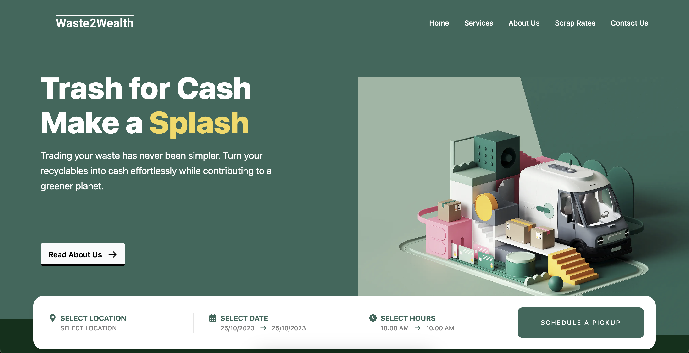

# Scrap Up



Welcome to **Scrap Up** – an innovative venture driven by technology and recognized under Start-up India. We're committed to transforming the way waste is managed and creating valuable opportunities for a sustainable future.

## About

Scrap Up is a pioneering project that leverages a SaaS (Software as a Service) model to revolutionize the waste management sector. Our mission is to turn waste into wealth, contributing to a cleaner, greener, and more prosperous world.

## Team

We're a team of dedicated individuals working together to make a difference. Meet the team members behind Scrap Up:

- [GitHub Profile - impossibleshadowstorm](https://github.com/impossibleshadowstorm)
- [GitHub Profile - kajalrituraj](https://github.com/kajalrituraj)
- [GitHub Profile - SaurHub123](https://github.com/SaurHub123)

## Getting Started

To run this project locally and explore its features, follow these steps:

1. Clone the [Scrap Up Backend Repository](https://github.com/impossibleshadowstorm/Scrap Up-backend) on GitHub.
2. Clone this repository.
3. Install the required dependencies by running:

   ```bash
   yarn
   ```
4. Install the required dependencies by running:

    ```bash
    yarn run dev
    ```
5. Open your web browser and navigate to http://localhost:3000.

## Deployment

The project is deployed and hosted on [Vercel](https://vercel.com) for the frontend and [Render.com](https://render.com) for the backend.

- **Frontend:** [Scrap Up on Vercel](https://Scrap Up-umber.vercel.app/)
- **Backend:** [Scrap Up Backend on GitHub](https://github.com/impossibleshadowstorm/Scrap Up-backend)

## Technologies Used

- Next.js
- Tailwind CSS
- Node.js
- Express
- MongoDB

## Contact Us

If you have any questions, suggestions, or would like to get in touch, feel free to contact us at [contact@Scrap Up.com](mailto:sumitsaurav1119@gmail.com).

Thank you for joining us on this journey from waste to wealth! 🌱♻️